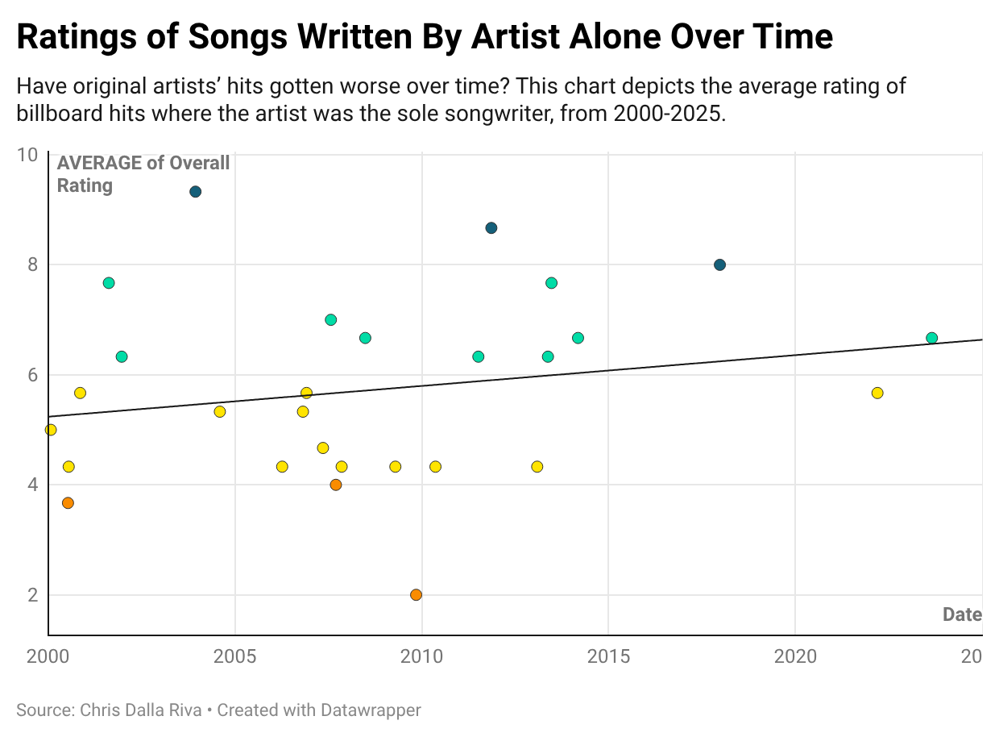
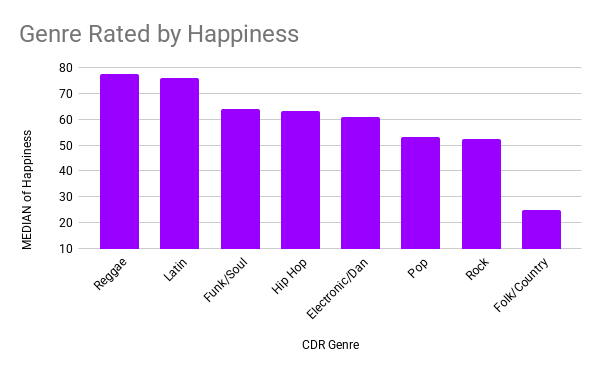

# Billboard Data Reveals the Music Industry is Resilient
Does billboard data reveal any insights about popular music culture? By studying the data of billboard hits from 1958-2025, we can make broader inferences about the music industry.

## Data Source:
My data comes from Chris Dalla Riva’s book, Uncharted Territory: What Numbers Tell Us about the Biggest Hit Songs and Ourselves. His journalistic and academic account argues that data can be used to explain mainstream music trends. The data is trustworthy, because most entries are explained by objective measures. For instance, “weeks at billboard #1” measures the unbiased performance of a song. Riva includes measures of happiness and dance ability, which may seem subjective, but he utilizes Spotify’s 0-100 score to gauge these values. While Spotify’s ratings of these categories may differ from other sources, including this consistent gauge for all songs in the data set makes it credible for the sake of comparison. For labeling songs by genre, he and his partner use the “CDR genre” and the “discogs genre.” Riva is an academic music expert, so while his own determination of genre through the CDR category may be subjective, his expertise gives his labels credibility. Additionally, implementing Discog’s genre categorizations provides a comparative data measure. This dataset of all 1,100+ Billboard number one hits encompasses pivotal information regarding hit songs from 1958 to 2025, but of course it does not reveal everything. For instance, more measures of a song’s performance could have been included, such as: Grammy wins, records sold, number of plays on Spotify, and more. Additionally, the data does not reflect cultural context. The methods in which listeners consumed music in 1958 widely differ from those consuming music during the coronavirus pandemic in 2020. 

## Methods and Data Analysis:
First, I looked at the data surrounding artists’ original songs. I filtered for songs written by the artist alone, and I also accounted for music in the 21st century. Of the 28 songs left in the data set, I then ranked them in descending order based on “overall rating,” which is the average of 3 judges’ ratings. Three songs were ranked at an 8 or better, three were ranked at 4 or below, and the 22 others were between 4 and 8. However, when I applied a trend line, the slope was positive, possibly indicating that from 2000 to 2025, original billboard number one songs have actually increased in overall ratings. While the chart does have a positive sloping trend line, the incline is marginal. Because 2025 is more recent than 2000, there are less billboard number one hits now, which may be skewing the data set. While my assumption that original songs now are worse than they used to be in my childhood (~2000s) has been disproven by the data, the few data points leaves room for uncertainty. It is likely that original billboard number ones now perform similarly to those at the beginning of the century.

I also utilized pivot tables to determine the occurrence of original songs before and after December 31, 1999. Are artists solely writing their music more or less in the 21st century than in the 20th? Before January 1, 2000, there were 850 #1 billboard hits (taking into account that this dataset begins in 1958). 291 of those 850 were completely originally written, meaning that ~34% of pre-2000 billboard #1 hits were originals. Of the 327 post-2000 hits, 28 were originals, which is ~9%. Given this stark distinction, it would be fair to conclude that modern billboard hits are less originally composed by the artist than they used to be. 

Second, I was interested in which genre is deemed the “happiest.” I omitted double counted genres and compared median happiness scores across eight genres. Reggae scored the highest, followed closely by Latin songs. I was surprised to find “pop” in the bottom half, due to my assumption that pop songs are fun and energetic. This dataset does include over 1100 songs, so the sample set is large, but the perhaps overgeneralization of genre may cause the upbeat pop songs to mix with slower, and even R&B songs as well. 

Third, I wanted to compare artists to each other. Who has the most weeks at billboard #1? What country has the top artists? I created a table of artists, their country of origin, and the sum of all the weeks one or more of their songs was #1. Mariah Carey totaled the most, at 68 weeks. She is followed by The Beatles at 58 weeks. Focusing on the top 13 artists, 1 was from Canada, 4 were from the UK, and the other 8 were from the US.

## Limitations and Final Summary: 
Most intriguingly, I found that billboard hits from the 20th century were more often originally written by the artist than they are in the 21st century. While the data does not tell us why this has occurred, it paints an intriguing fact. Future journalistic work could collect information about songwriting, composing, and producing that offers context about why truly original music is not proportionately represented in the billboards.

Furthermore, Mariah Carey is the leading artist in weeks at billboard #1. Looking at this dataset, the United States has the most cumulative weeks at number 1, so does that mean that American music is the best? One of the challenges of data studies is that quantitative measures are not all encompassing. Even if the numbers tell one story, data narration can differ so much that the same numbers reveal different conclusions. Despite the US collecting the highest sum of weeks at billboard number one, this alone cannot confidently conclude that American artists produce the “best” music.

Additionally, I found that reggae is the “happiest” in a group of eight genres. This may suggest that popular music taste is open to diverse cultures. Music culture appears to favor Western songs, but Caribbean sounds are portrayed to be “happier.” However, limitations for this result lie in: the Latin category is only marginally lower scoring than reggae, and the broad definitions of genre may merge traditionally upbeat, “happier” sub-genres with slower counterparts. 

I had originally assumed that original artist’s songs now are worse than they were in the early 2000s. By analyzing the average overall ratings of “artist only songwriter” songs from 2000-2025, I actually disproved myself and saw a positive sloping trend line as time progressed. I concluded that this positive slope does not have enough data points to be statistically significant, but was enough to challenge my theory and at least describe that original songs now perform comparatively to how they did in the early 2000s.

In essence, the music industry is resilient. It has remained relatively stable in performance of original songs for the last two and a half decades. While the occurrence of artist-written billboard hits have become less frequent since the turn of the century, this suggests that the music industry evolves as technology changes. The “happiness” indicator of genre implies that the industry is not rigid: it is receptive to non-Western melodies.

For future studies of mainstream music, more data is always beneficial. As more songs are released and consumed, more songs will be added to this billboard #1 data set. It would be interesting to see measures surrounding music awards, generalized public opinion statistics, technological advances, changes in musical consumption methodologies, and artist demographics. 

## Links:
- [Billboard Hot 100 Number Ones Database, Riva](https://docs.google.com/spreadsheets/d/1j1AUgtMnjpFTz54UdXgCKZ1i4bNxFjf01ImJ-BqBEt0/edit?gid=1974823090#gid=1974823090)
- [My Google Sheet](https://docs.google.com/spreadsheets/d/172eEkf848OgRYIWiBz7N_rFvuSd3kRCRevFx5GiF7ns/edit?usp=sharing)
